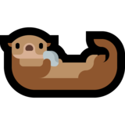

# ** Swimmy Otter**

A game of dodging logs and grabbing clocks.

**[(Link to Backend)](https://github.com/Jeffrey-Marks/swimmy-otter)**

## Inspiration

I wanted to make a game in vanilla JS and learn about the difference in paradigms between game and web development. Plus, otters are cute.

## Features

Left and right arrow keys to move. The otter's speed increases as the game goes on. Grabbing a stopwatch will decrease the game speed.

Logs come down in a range of speeds, the floor of which increases as the game goes on. They also come down at a random X-position. Together, these features combine to promise every game is different. Every tick, each log has its position updated relative to its speed. Once a log has gone past the bottom of the screen, it is removed and no longer updated. The position of each log is constantly checked to see if it is overlapping with the otter (i.e. has collided).

When the otter collides with a log, a time score will be posted to the backend under the username provided at the start.

## Built With

* [Easel.js](https://www.createjs.com/easeljs) - Library for creating and moving elements on an HTML `<canvas>`.

## Notes

Any resemblance to the name of any notorious mobile game is purely coincidental.
